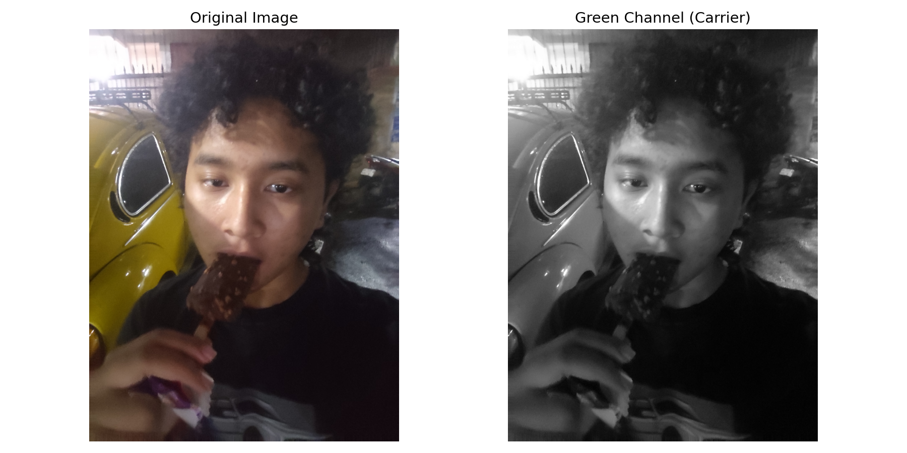
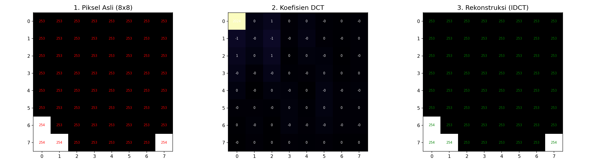
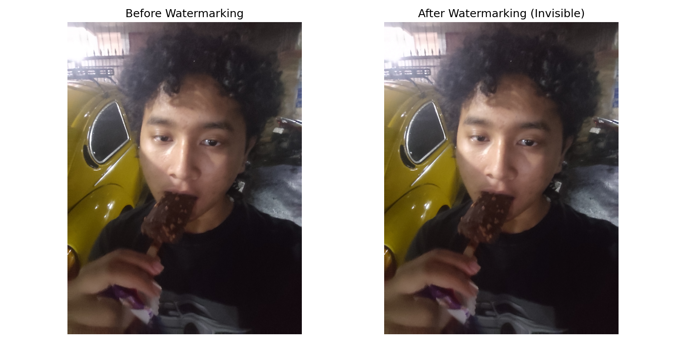
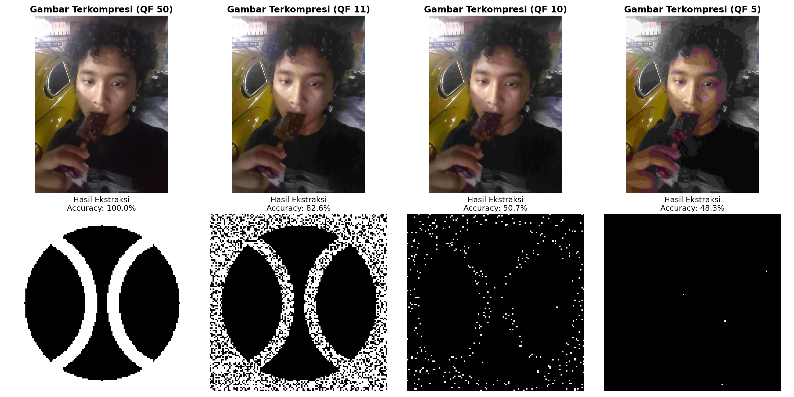

# Sistem Watermarking Gambar DCT-based

Proyek ini mengimplementasikan sistem *digital watermarking* menggunakan transformasi frekuensi **Discrete Cosine Transform (DCT)**. Sistem ini dirancang agar logo yang disisipkan tetap dapat diekstraksi meskipun gambar telah dikompresi dengan kualitas JPEG yang rendah, dan didesain untuk langsung menampilkan perbedaan antar Quality Factor.

---

## Cara Instalasi dan Penggunaan

### 1. Clone Repositori
Buka terminal atau command prompt, lalu jalankan:
```bash
git clone https://github.com/username/II2240-Sistem-Multimedia-Watermark.git
cd II2240-Sistem-Multimedia-Watermark
```

### 2. Membuat Virtual Environment
Disarankan untuk menggunakan virtual environment agar tidak mengganggu package global.

**Windows:**
```bash
python -m venv .venv
.\.venv\Scripts\activate
```

**Linux/macOS:**
```bash
python3 -m venv .venv
source .venv/bin/activate
```

### 3. Install Dependencies
Pastikan virtual environment sudah aktif, lalu instal library yang dibutuhkan:
```bash
pip install -r .requirements.txt
```

### 4. Menjalankan Skrip
Setelah instalasi selesai, Anda dapat menjalankan skrip berikut sesuai urutan:
1.  **Generate Logo**: `python main/create_logo.py` (Membuat logo baseball awal).
2.  **Evaluasi & Ekstraksi**: `python main/watermark_eval.py` (Menyisipkan watermark dan menguji ketangguhannya).
3.  **Visualisasi Dokumentasi**: `python main/generate_readme_assets.py` (Memperbarui aset gambar untuk README ini).

---

## Alur Kerja Teknis

Berikut adalah langkah-langkah detail bagaimana watermark disisipkan ke dalam gambar:

### 1. Pre-proses Logo
Logo (128x128 piksel) digenerate secara programatik menggunakan skrip `create_logo.py`. Gambar ini kemudian dikonversi menjadi matriks biner (0 untuk hitam, 1 untuk putih). Setiap piksel logo ini mewakili satu bit informasi yang akan disebar ke dalam blok frekuensi gambar induk.


### 2. Pemisahan Kanal Warna
Gambar digital (RGB) dipisahkan menjadi tiga kanal warna dasar: Merah (Red), Hijau (Green), dan Biru (Blue). Kami memilih kanal **Hijau** sebagai media penyimpanan karena mata manusia lebih sensitif terhadap detail pada kanal ini, dan algoritma kompresi JPEG cenderung lebih menjaga integritas data pada kanal ini dibandingkan kanal Biru.



### 3. Transformasi Frekuensi (DCT)
Setiap blok 8x8 piksel pada kanal Hijau diubah dari domain spasial (pixel) ke domain frekuensi menggunakan DCT. Proses ini memisahkan informasi gambar menjadi komponen frekuensi tinggi dan rendah.



- **Piksel Asli**: Mewakili intensitas cahaya pada koordinat tertentu.
- **Koefisien DCT**: Mewakili amplitudo frekuensi. Koefisien kiri atas (DC) adalah nilai rata-rata, sementara koefisien lainnya adalah detail frekuensi. Watermark disisipkan pada koefisien frekuensi rendah-menengah untuk menjaga keseimbangan antara ketangguhan dan kualitas visual.

### 4. Penyisipan Data (Embedding)
Data disisipkan dengan memanipulasi hubungan antara dua koefisien DCT tertentu. Karena perubahan dilakukan di domain frekuensi, watermark menjadi "menyatu" dengan pola gambar sehingga sulit dihilangkan oleh kompresi.



### 5. Peta Perbedaan (Difference Map)
Gambar di bawah menunjukkan selisih nilai piksel antara gambar asli dan gambar yang telah disisipkan watermark. Piksel yang berwarna putih/terang menunjukkan lokasi blok di mana nilai frekuensi gambar telah dimodifikasi untuk menyimpan bit logo, sementara area hitam menunjukkan bagian gambar yang tetap asli tanpa perubahan.


### 6. Ekstraksi dan Uji Ketangguhan
Langkah terakhir adalah mengekstraksi kembali watermark dari gambar yang telah dikompresi. Gambar di bawah menunjukkan perbandingan antara **gambar induk yang terkompresi** (baris atas) dan **logo yang berhasil diekstraksi** (baris bawah) pada berbagai tingkat kualitas JPEG.



#### Analisis Performa:
| Rentang QF | Akurasi (%) | Status |
| :--- | :--- | :--- |
| **QF 50** | **100%** | **Sangat Tangguh**: Logo berhasil diekstraksi sempurna. |
| **QF 11** | **82.64%** | **Drop Point**: Noise mulai muncul namun logo masih terbaca. |
| **QF 10** | **50.73%** | **Batas Kegagalan**: Data mulai hancur secara masif. |
| **QF 5** | **~48%** | **Data Hilang**: Hasil hanya berupa noise acak. |

**Kesimpulan Teknis:**
Algoritma ini memiliki *threshold* ketahanan yang sangat baik hingga **QF 12** (>99% akurasi). Penurunan tajam terjadi di bawah QF 11, di mana algoritma kompresi JPEG mulai membuang informasi frekuensi menengah secara agresif. Penggunaan redundansi bit (Majority Voting) terbukti efektif menjaga integritas data hingga batas kompresi ekstrem tersebut.

---

## Konfigurasi & Penyimpanan Hasil

### Mengubah Quality Factor (QF)
Anda dapat mengubah daftar nilai kualitas JPEG yang ingin diuji dengan mengedit variabel `qf_values` di dalam skrip `main/watermark_eval.py`:
```python
# Cari baris ini di main/watermark_eval.py
qf_values = [100, 90, 75, 50, 20, 11, 8, 5] 
```
Anda bisa menambah atau mengurangi angka di dalam list tersebut (rentang 1-100).

### Lokasi Penyimpanan
Semua hasil pemrosesan dari skrip evaluasi akan disimpan secara otomatis di folder **`result/`**:
- **`image_qfXX.jpg`**: Gambar hasil penyisipan watermark yang telah dikompresi.
- **`extracted_qfXX.png`**: Logo hasil ekstraksi dari gambar tersebut.

Folder **`assets/`** digunakan khusus untuk menyimpan file sumber dan gambar pendukung dokumentasi.

---

## Struktur Folder
- `assets/`: Berisi gambar sumber (`test_image.jpg`), logo (`logo.png`), serta aset gambar permanen untuk dokumentasi README.
- `main/`:
  - `create_logo.py`: Membuat logo dasar 128x128.
  - `watermark_eval.py`: Skrip utama untuk pengujian watermarking (Output: folder `result/`).
  - `visualize_steps.py`: Menghasilkan gambar visualisasi teknis ke folder `assets/`.
  - `generate_readme_assets.py`: Menghasilkan aset gambar untuk dokumentasi ke folder `assets/`.
- `result/`: Folder *output* khusus untuk hasil gambar terkompresi dan logo hasil ekstraksi.

---